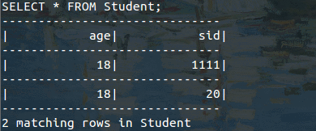

## Test document for Compliers Course Project
#### Class 1 - group 10

| Name | Student ID | Job |
|--------|--------|--------|
| Fan Ziyao | 12330081 | Team leader, database implementation|
| Chen Zeyu | 12330056 | System implementation |
| Huang Long | 12330132 | Database implementation |
| Zhang Qiuyi (Class 2) | 12330402 | Frontend, documentation |
| Zhu Lichen (Class 2) | 12330439 | Testing |

### Create

#### #1 Normal create

#### #2 Two or more columns with the same name

#### #3 Multiple primary key definitions

#### #4 Primary key is not defined as a column

#### #5 Create an existing table

### Insert

#### #1 Normal insert

#### #2 Duplicate column

#### #3 Insert with a column that is not in the schema

#### #4 Insert with differnt number of columns and values

#### #5 Key constraint violation

#### #6 Insert into a table that doesn't exist

#### #7 Insert without keys

#### #6 Insert with default values

### Query

#### #1 Select every columns and every rows

#### #2 Select specific columns 1

#### #3 Select specific columns 2

#### #4 Select with no matching rows

#### #5 Select with a simple where clause

#### #7 Select a column that is not in the schema

#### #8 Select with a where clause referencing a column not in the schema

### Expressions
#### #1 Select with a complex where clause

#### #2 Select with a complex where clause

#### #3 Insert with a complex value

#### #4 Create a table with complex defaults

#### #5 Delete with a complex where clause

### Delete
#### #1 Delete with a simple where clause

#### #2 Delete all rows

#### #3 Delete with a where clause referencing a column not in the schema

### Division by zero

#### Division by zero in simple expressions

#### Division by zero in where clase

#### Divsion by zero in row evaluations

### Error Recoveries

#### Parse error

#### Skip invalid lexeme

