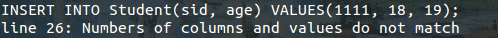

# Test document for Compliers Course Project
### Class 1 - group 10

| Name | Student ID | Job |
|--------|--------|--------|
| Fan Ziyao | 12330081 | Team leader, database implementation|
| Chen Zeyu | 12330056 | System implementation |
| Huang Long | 12330132 | Database implementation |
| Zhang Qiuyi (Class 2) | 12330402 | Frontend, documentation |
| Zhu Lichen (Class 2) | 12330439 | Testing |

## Create

### #1 Normal create

#### Input

    CREATE TABLE Student(sid INT,
    age INT DEFAULT = 18,
    PRIMARY KEY (sid));

#### Expected Output
    Created table Student

#### Result: Passed

### #2 Two or more columns with the same name
#### Input

    CREATE TABLE Student2(sid INT,
    age INT DEFAULT = 18,
    PRIMARY KEY (sid),
    age INT);

#### Expected Output

    line #: Multiple definitions for age

(`#` means a line number)

#### Result: Passed

### #3 Multiple primary key definitions
#### Input

    CREATE TABLE Student3(sid INT,
    PRIMARY KEY (sid),
    age INT DEFAULT = 18,
    PRIMARY KEY (age));

#### Expected Output

    line #: Multiple primary key definitions

#### Result: Passed

### #4 Primary key is not defined as a column
#### Input

    CREATE TABLE Student4(sid INT,
    PRIMARY KEY (sid, height),
    age INT DEFAULT = 18);

#### Expected Output

    line #: Undefined key height

#### Result: Passed

### #5 Create an existing table
#### Input

    CREATE TABLE Student(sid INT,
    age INT DEFAULT = 18,
    PRIMARY KEY (sid));

#### Expected Output

    line #: Table Student already exists

#### Result: Passed

## Insert

### #1 Normal insert
#### Input

    INSERT INTO Student(sid, age) VALUES(1111, 18);

#### Expected Output

    Inserted 1 rows into table Student

#### Result: Passed

### #2 Duplicate column
#### Input

    INSERT INTO Student(sid, age, age) VALUES(1111, 18, 19);

#### Expected Output

    line #: Duplicate column age

#### Result: Passed

### #3 Insert with a column that is not in the schema
#### Input

    INSERT INTO Student(sid, height) VALUES(1111, 18);

#### Expected Output

    line #: Column height is not in the schema

#### Result: Passed

### #4 Insert with differnt number of columns and values
#### Input

    INSERT INTO Student(sid, age) VALUES(1111, 18, 19);

#### Expected Output

    line #: Numbers of columns and values do not match

#### Result: Passed

### #5 Key constraint violation
#### Input

    INSERT INTO Student(sid, age) VALUES(1111, 18);

#### Expected Output

    line #: Record already exists

#### Result: Passed

### #6 Insert into a table that doesn't exist
#### Input

    INSERT INTO Student5(sid, age) VALUES(1111, 18);

#### Expected Output

    line #: Cannot find table Student5

#### Result: Passed

### #7 Insert without keys
#### Input

    INSERT INTO Student(age) VALUES(20);

#### Expected Output

    line #: Key sid not found

#### Result: Passed

### #6 Insert with default values
#### Input

    INSERT INTO Student(sid) VALUES(20);

#### Expected Output

    Inserted 1 rows into table Student

#### Result: Passed

## Query

### #1 Select every columns and every rows
#### Input

    SELECT * FROM Student;

#### Expected Output

Records just inserted.

#### Result: Passed

### #2 Select specific columns 1
#### Input

    SELECT sid, age FROM Student;

#### Expected Output

Data same as #1, with order of column switched.

#### Result: Passed

### #3 Select specific columns 2
#### Input

    SELECT age FROM Student;

#### Expected Output

Data same as #1, with column age only.

#### Result: Passed

### #4 Select with no matching rows
#### Input

    SELECT sid, age FROM Student WHERE age < 18;

#### Expected Output

	No matching rows in Student

#### Result: Passed

### #5 Select with a simple where clause
#### Input

    SELECT sid, age FROM Student WHERE age < sid;

#### Expected Output

Same as #2.

#### Result: Passed

### #6 Select a column that is not in the schema

#### Input

    SELECT sid, height FROM Student WHERE age < 18;

#### Expected Output

	line #: Column height is not in the schema

#### Result: Passed

### #7 Select with a where clause referencing a column not in the schema
#### Input

    SELECT sid, age FROM Student WHERE height < 180;

#### Expected Output

	line #, height not found in the scheme

#### Result: Passed

## Expressions
### #1 Select with a complex where clause
#### Input

    INSERT INTO Student(sid, age) VALUES(90, 25);
    SELECT * FROM Student
    WHERE age + 7 > 19 + 6 && sid <> 6 / 3 - 2;

#### Expected Output

Only the record with age = 25, side = 90.

#### Result: Passed

### #2 Select with a complex where clause
#### Input

    SELECT sid, age FROM Student WHERE age + 1 / 2 >= 18 && sid <> 1111;

#### Expected Output

2 records, one with age = 25, sid = 90, one with age = 18, sid = 20.

#### Result: Passed

### #3 Insert with a complex value
#### Input

    INSERT INTO Student(sid, age) VALUES(6 * 3 / 4 + 1, 32 * 3 - 6 / 2);
    SELECT * FROM Student;

#### Expected Output

	Inserted 1 rows into table Student

A record with age = 93, sid = 5 should appear in the query result.

#### Result: Passed

### #4 Create a table with complex defaults
#### Input

    CREATE TABLE Student2(sid INT DEFAULT = 6 * 3 / 4 + 1,
    age INT DEFAULT = 32 * 3 - 6 / 2, PRIMARY KEY (sid));
    INSERT INTO Student2(sid) VALUES(0);
    SELECT * FROM Student2;

#### Expected Output

	Created table Student2
	Inserted 1 rows into table Student2

A record with age = 93, sid = 0 should appear in the query result.

#### Result: Passed

### #5 Delete with a complex where clause
#### Input

    SELECT * FROM Student;
    DELETE FROM Student
    WHERE age + 7 > 19 + 6 && sid <> 6 / 3 - 2;
    SELECT * FROM Student;

#### Expected Output

Before deletion, there should be 4 records in the query result. The delete statement should have a feed back:

	Deleted 2 rows from table Student

After deletion, there should be 2 records in the query result, one with age = 18, sid = 1111, one with age = 18, age = 20.

#### Result: Passed

## Delete
### #1 Delete with a simple where clause
#### Input

    INSERT INTO Student(age, sid) VALUES(17, 25);
    SELECT * FROM Student;
    DELETE FROM Student WHERE age < 18 && age > 14;
    SELECT * FROM Student;

#### Expected Output

Before deletion, there should be 3 records in the query result. The delete statement should have a feed back:

	Deleted 1 rows from table Student

After deletion, there should be 2 records in the query result, one with age = 18, sid = 1111, one with age = 18, age = 20.

#### Result: Passed

### #2 Delete all rows
#### Input

	SELECT * FROM Student;
    DELETE FROM Student;
    SELECT * FROM Student;

#### Expected Output

Before deletion, there should be 2 records in the query result. The delete statement should have a feed back:

	Deleted 2 rows from table Student

After deletion, there should be no more records in the table. Hence the feedback should be:

	No matching rows in Student

#### Result: Passed

### #3 Delete with a where clause referencing a column not in the schema
#### Input

    INSERT INTO Student(sid, age) VALUES(1, 10);
    SELECT * FROM Student;
    DELETE FROM Student WHERE age < 18 && height > 180;
    SELECT * FROM Student;

#### Expected Output

Before deletion, there should be 1 record in the query result. The delete statement should have a feed back:

	line #, height not found in the scheme

After deletion, the records in the table should not be changed.

#### Result: Passed

## Division by zero

### Division by zero in simple expressions
#### Input

	SELECT age FROM Student WHERE age / 0 + 7 > sid;
    INSERT INTO Student(sid, age) VALUES(6 * 3 / 0, 32 * 3 - 6 / 2);
    SELECT age FROM Student WHERE age / 0 + 7 > sid;

#### Expected Output

Before insertion, there should be 1 record in the query result. The delete statement should have a feed back:

	line #, Division by zero

After insertion, the records in the table should not be changed.

#### Result: Passed

### Division by zero in where clase
#### Input

    INSERT INTO Student(sid, age) VALUES(6 * 3 / 0, 32 * 3 - 6 / 2);
    SELECT age FROM Student WHERE age / 0 + 7 > sid;

#### Expected Output

The delete statement should have a feed back:

	line #, Division by zero

#### Result: Passed

### Divsion by zero in row evaluations
#### Input

    INSERT INTO Student(sid, age) VALUES(77, 0);
    SELECT * FROM Student;
    SELECT * FROM Student WHERE sid / age > sid;

#### Expected Output

Before insertion, there should be 2 records in the query result. The query statement should have a feed back:

	line #, Division by zero

#### Result: Passed

## Error Recoveries

### Parse error
#### Input

    SELECT / FROM Student;

#### Expected Output

	line #, column 7: Syntax error

#### Result: Passed

### Skip invalid lexeme
#### Input

    SELECT * FROM Student;
    INSERT # INTO Student(sid, age) VALUES(55, 5);
    SELECT * FROM Student;

#### Expected Output

Before insertion, there should be 2 records in the query result. The insert statement should have a feed back:

	line #, column 9: Invalid lexeme #

But this invalid lexeme will be ignored, followed by one more feedback:

	Inserted 1 rows into table Student

After insertion, there will be a record with sid = 55, age = 5 in the table.

#### Result: Passed

